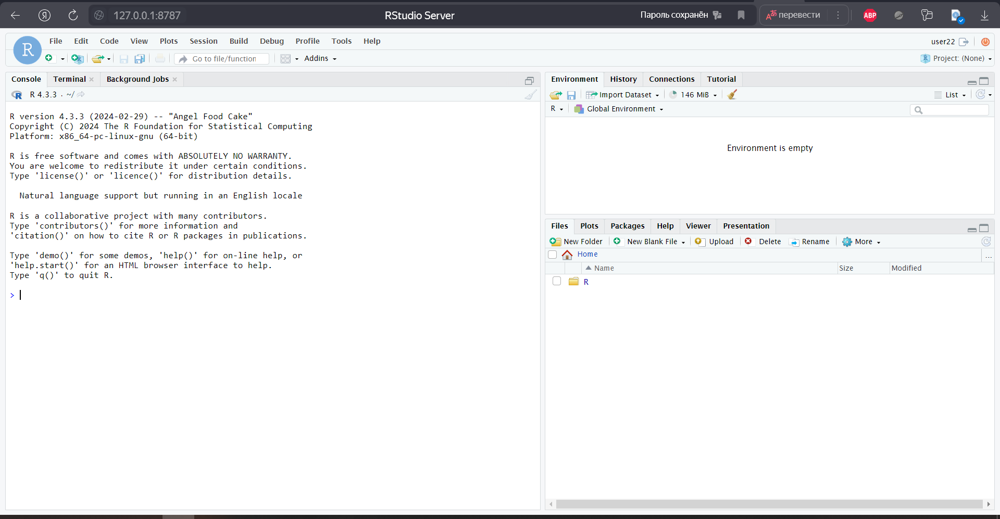

# Практическое задание №3
Емельяненко Мария БИСО-01-20

# Анализ данных сетевого трафика при помощи библиотеки `Arrow`

## Цель работы

1.  Изучить возможности технологии **Apache Arrow** для обработки и
    анализа больших данных
2.  Получить навыки применения Arrow совместно с языком программирования
    R
3.  Получить навыки анализа метаинфомации о сетевом трафике
4.  Получить навыки применения облачных технологий хранения, подготовки
    и анализа данных: **Yandex Object Storage**, **Rstudio Server**

## Исходные данные

1.  ОС Windows 10
2.  RStudio Server
3.  Yandex Cloud: S3 Object Storage
4.  Датасет tm_data.pqt

**Общая ситуация**

Вы – специалист по информационной безопасности компании “СуперМегатек”.
Вы, являясь специалистом Threat Hunting, часто используете информацию о
сетевом трафике для обнаружения подозрительной и вредоносной активности.
Помогите защитить Вашу компанию от международной хакерской группировки
AnonMasons.

У Вас есть данные сетевой активности в корпоративной сети компании
“СуперМегатек”. Данные хранятся в Yandex Object Storage.

## Задание

Используя язык программирования R, библиотеку `arrow` и облачную IDE
Rstudio Server, развернутую в **Yandex Cloud**, выполнить задания и
составить отчет

## Ход работы

### Шаг 1. Настройка подключения к IDE Rstudio Server

##### 1. Подключимся к удалённому серверу через `ssh` и сразу поменяем пароль от пользователя `user21`:

##### 

##### 

##### 2. Перейдём по адресу `locahost:8787` и залогинимся под нашим пользователем:

##### 



##### 3. Создадим пару ssh ключей и склонируем репозиторий с GitHub:

##### 4. Добавим публичный ключ в список знакомых на GitHub, для того чтобы потом можно было сделать push:

### 

### Шаг 2. Установка библиотек и импорт датасета

Установим необходимые билбиотеки:

``` r
library(arrow, warn.conflicts = FALSE)
```

    Some features are not enabled in this build of Arrow. Run `arrow_info()` for more information.

``` r
library(tidyverse, warn.conflicts = FALSE)
```

    ── Attaching core tidyverse packages ──────────────────────── tidyverse 2.0.0 ──
    ✔ dplyr     1.1.4     ✔ readr     2.1.5
    ✔ forcats   1.0.0     ✔ stringr   1.5.1
    ✔ ggplot2   3.4.4     ✔ tibble    3.2.1
    ✔ lubridate 1.9.3     ✔ tidyr     1.3.1
    ✔ purrr     1.0.2     

    ── Conflicts ────────────────────────────────────────── tidyverse_conflicts() ──
    ✖ lubridate::duration() masks arrow::duration()
    ✖ dplyr::filter()       masks stats::filter()
    ✖ dplyr::lag()          masks stats::lag()
    ℹ Use the conflicted package (<http://conflicted.r-lib.org/>) to force all conflicts to become errors

Скачаем датасет:

``` r
dir.create("data", showWarnings = FALSE)

curl::multi_download(
  "https://storage.yandexcloud.net/arrow-datasets/tm_data.pqt",
  "data/tm_data.pqt",
  resume = TRUE
)
```

    # A tibble: 1 × 10
      success status_code resumefrom url    destfile error type  modified
      <lgl>         <int>      <dbl> <chr>  <chr>    <chr> <chr> <dttm>  
    1 TRUE            416          0 https… /home/u… <NA>  appl… NA      
    # ℹ 2 more variables: time <dbl>, headers <list>

Откроем датасет и взглянем на него:

``` r
df <- arrow::open_dataset(sources = "data/tm_data.pqt", 
                          format  = "parquet")

df %>% glimpse()
```

    FileSystemDataset with 1 Parquet file
    105,747,730 rows x 5 columns
    $ timestamp <double> 1.578326e+12, 1.578326e+12, 1.578326e+12, 1.578326e+12, 1.5…
    $ src       <string> "13.43.52.51", "16.79.101.100", "18.43.118.103", "15.71.108…
    $ dst       <string> "18.70.112.62", "12.48.65.39", "14.51.30.86", "14.50.119.33…
    $ port       <int32> 40, 92, 27, 57, 115, 92, 65, 123, 79, 72, 123, 123, 22, 118…
    $ bytes      <int32> 57354, 11895, 898, 7496, 20979, 8620, 46033, 1500, 979, 103…
    Call `print()` for full schema details

Преобразуем тип данных для поля `timestamp`:

``` r
df <- df %>%
  mutate(timestamp = as_datetime(timestamp / 1000, origin = "1970-01-01", tz = "UTC"))

df %>% glimpse()
```

    FileSystemDataset with 1 Parquet file (query)
    105,747,730 rows x 5 columns
    $ timestamp <timestamp[ns, tz=UTC]> 2020-01-06 16:19:19, 2020-01-06 16:19:19, 20…
    $ src                      <string> "13.38.72.85", "18.99.75.43", "12.54.59.43",…
    $ dst                      <string> "18.49.86.46", "13.57.72.73", "17.77.98.108"…
    $ port                      <int32> 74, 52, 89, 90, 40, 77, 96, 39, 119, 57, 119…
    $ bytes                     <int32> 78891, 26744, 44243, 42, 3361, 1160, 1204, 7…
    Call `print()` for query details

### Шаг 3. Выполнение заданий

##### Задание 1: Надите утечку данных из Вашей сети

Важнейшие документы с результатами нашей исследовательской деятельности
в области создания вакцин скачиваются в виде больших заархивированных
дампов. Один из хостов в нашей сети используется для пересылки этой
информации – он пересылает гораздо больше информации на внешние ресурсы
в Интернете, чем остальные компьютеры нашей сети. Определите его
IP-адрес.

``` r
df_filtered <- df %>%
  filter(str_detect(src, "^1[2-4].")) %>%
  filter(!str_detect(dst, "^1[2-4]."))

answer_1 <- df_filtered %>%
  group_by(src) %>% 
  summarise(sum_traffic = sum(bytes)) %>%
  arrange(desc(sum_traffic)) %>%
  head(1)

answer_1 %>% collect()
```

    # A tibble: 1 × 2
      src          sum_traffic
      <chr>            <int64>
    1 13.37.84.125 10625497574

**Ответ: 13.37.84.125**

##### Задание 2: Надите утечку данных 2

Другой атакующий установил автоматическую задачу в системном
планировщике `cron` для экспорта содержимого внутренней wiki системы.
Эта система генерирует большое количество трафика в нерабочие часы,
больше чем остальные хосты. Определите IP этой системы. Известно, что ее
IP адрес отличается от нарушителя из предыдущей задачи.

Для начала необходимо определить рабочие часы: в нашем случае это время
с 16:00 до 23:59, если судить по движению трафика

``` r
work_time <- df %>%
  group_by(hour(timestamp)) %>%
  summarise(sum_traffic = sum(bytes)) %>%
  arrange(desc(sum_traffic))

work_time %>% collect()
```

    # A tibble: 24 × 2
       `hour(timestamp)`  sum_traffic
                   <int>      <int64>
     1                23 274018545181
     2                18 273957078313
     3                16 273911433028
     4                20 273906852618
     5                21 273870082226
     6                22 273865554455
     7                19 273843857318
     8                17 273636993943
     9                 7  10566144869
    10                 8  10471822189
    # ℹ 14 more rows

Теперь найдём IP-адрес нарушителя по максимальному объёму исходящего
трафика в нерабочее время:

``` r
answer_2 <- df_filtered %>%
  filter(!str_detect(src, "^13.37.84.125$")) %>%
  filter(!between(hour(timestamp), 16, 23)) %>%
  group_by(src) %>%
  summarise(sum_traffic = sum(bytes)) %>%
  arrange(desc(sum_traffic)) %>%
  head(1)
  
answer_2 %>% collect()
```

    # A tibble: 1 × 2
      src         sum_traffic
      <chr>             <int>
    1 12.55.77.96   289566918

**Ответ: 12.55.77.96**

##### Задание 3: Надите утечку данных 3

Еще один нарушитель собирает содержимое электронной почты и отправляет в
Интернет используя порт, который обычно используется для другого типа
трафика. Атакующий пересылает большое количество информации используя
этот порт, которое нехарактерно для других хостов, использующих этот
номер порта. Определите IP этой системы. Известно, что ее IP адрес
отличается от нарушителей из предыдущих задач.

Для начала найдём средние значения трафика для каждого порта:

``` r
avg_traffic_by_port <- df_filtered %>%
  group_by(src, port) %>%
  summarise(bytes_ip_port = sum(bytes)) %>%
  group_by(port) %>%
  summarise(avg_traffic = mean(bytes_ip_port)) %>%
  arrange(desc(avg_traffic))

avg_traffic_by_port %>% collect() %>% head(5)
```

    # A tibble: 5 × 2
       port avg_traffic
      <int>       <dbl>
    1    36  2070876332
    2    95  2031985904
    3    21  2027501066
    4    78  2018366254
    5    32  1989408807

Также, найдём максимальные значения трафика по порту:

``` r
max_src_traffic_by_port <- df_filtered %>%
  group_by(src, port) %>%
  summarise(sum_traffic = sum(bytes)) %>%
  collect() %>%
  group_by(port) %>%
  top_n(1, wt = sum_traffic) %>%
  arrange(desc(sum_traffic))

max_src_traffic_by_port %>% collect() %>% head(5)
```

    # A tibble: 5 × 3
    # Groups:   port [5]
      src           port sum_traffic
      <chr>        <int>       <int>
    1 13.37.84.125    36  2070876332
    2 13.37.84.125    95  2031985904
    3 13.37.84.125    21  2027501066
    4 13.37.84.125    78  2018366254
    5 13.37.84.125    32  1989408807

Соединим 2 предыдущих датафрейма по полю `port`:

``` r
merged_df <- merge(max_src_traffic_by_port, avg_traffic_by_port, by = "port")

merged_df %>% collect() %>% head(5)
```

      port          src sum_traffic  avg_traffic
    1   21 13.37.84.125  2027501066 2.027501e+09
    2   22  13.48.72.30     2375442 9.634543e+05
    3   23  13.48.72.30     2401470 9.634542e+05
    4   25  13.48.72.30       52710 2.024677e+04
    5   26  13.48.72.30     2468348 9.626804e+05

Найдём ip-адрес нарушителя, чьё отношение максимального трафика по порту
к среднему трафику по порту:

``` r
answer_3 <- merged_df %>%
  mutate(anomally_attitide = sum_traffic / avg_traffic) %>%
  arrange(desc(anomally_attitide)) %>%
  head(1)

answer_3 %>% collect()
```

      port         src sum_traffic avg_traffic anomally_attitide
    1  124 12.30.96.87      356207    20599.12          17.29234

**Ответ: 12.30.96.87**

## Оценка результатов

В результате практической работы был проведен анализ сетевой активности
с помощью `Apache Arrow` и были найдены утечки данных

## Вывод

Были получены навыки работы с технологией `Apache Arrow` для обработки и
анализа больших данных
